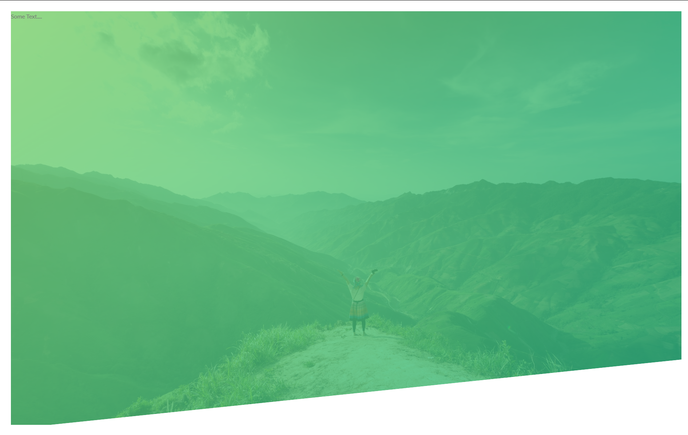
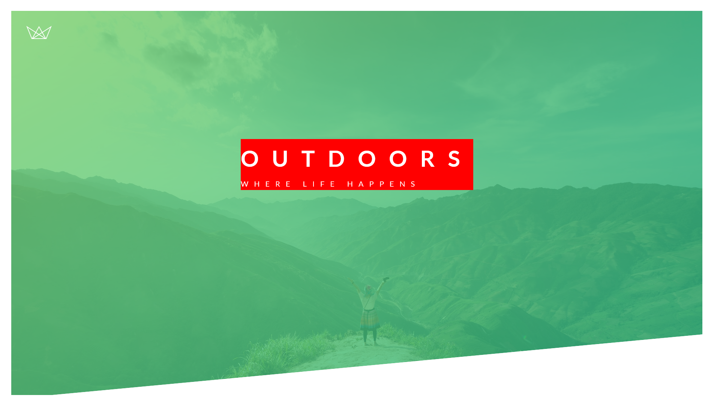
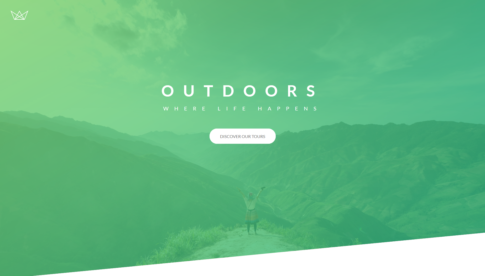

# Travel

## CSS Topics List With References

1. [Linear-gradient(Reference)](https://css-tricks.com/snippets/css/css-linear-gradient/)
1. [Clip path](https://css-tricks.com/almanac/properties/c/clip-path/)

## Boiler Plate HTML

```HTML
<!DOCTYPE html>
<html lang="en">
<head>
    <meta charset="UTF-8">
    <meta name="viewport" content="width=device-width, initial-scale=1.0">
    <!-- this is Google Font Import -->
    <link href="https://fonts.googleapis.com/css2?family=Lato:wght@100;300;400;700;900&display=swap" rel="stylesheet">

    <title>Travel</title>
</head>
<body>

</body>
</html>
```

## Adding Basic Styles

```css
/*
this is called a universal selector
*/
* {
  margin: 0;
  padding: 0;
  box-sizing: border-box;
}
/*
using added google font
line height 1.7 means 1.7 times reference size

*/
body {
  font-family: "Lato", sans-serif;
  font-weight: 400;
  font-size: 16px;
  line-height: 1.7;
  color: #777;
  padding: 30px;
}

.header {
  height: 95vh;
  background-image: linear-gradient(
      to right bottom,
      rgba(126, 213, 111, 0.8),
      rgba(40, 180, 133, 0.8)
    ), url("../img/travel.jpg");
  background-size: cover;
  background-position: top;
  background-repeat: no-repeat;
  clip-path: polygon(0 0, 100% 0, 100% 80vh, 0 101%);
}
```

## output after the changes



## Adding Header text

```html
<!DOCTYPE html>
<html lang="en">
  <head>
    <meta charset="UTF-8" />
    <meta name="viewport" content="width=device-width, initial-scale=1.0" />
    <link
      href="https://fonts.googleapis.com/css2?family=Lato:wght@100;300;400;700;900&display=swap"
      rel="stylesheet"
    />
    <link rel="stylesheet" href="./css/style.css" />
    <link rel="shortcut icon" href="./img/favicon.png" type="image/x-icon" />
    <title>Travel</title>
  </head>
  <body>
    <header class="header">
      <div class="logo-box">
        
      </div>
      <div class="text-box">
        <h1 class="heading-primary">
          <span class="heading-primary-main">Outdoors</span>
          <span class="heading-primary-sub">where life happens</span>
        </h1>
      </div>
    </header>
  </body>
</html>
```

```css
/*
this is called a universal selector
*/
* {
  margin: 0;
  padding: 0;
  box-sizing: border-box;
}

body {
  font-family: "Lato", sans-serif;
  font-weight: 400;
  font-size: 16px;
  line-height: 1.7;
  color: #777;
  padding: 30px;
}

.header {
  height: 95vh;
  background-image: linear-gradient(
      to right bottom,
      rgba(126, 213, 111, 0.8),
      rgba(40, 180, 133, 0.8)
    ), url("../img/travel.jpg");
  background-size: cover;
  background-position: top;
  background-repeat: no-repeat;
  clip-path: polygon(0 0, 100% 0, 100% 80vh, 0 101%);
  position: relative;
}

.logo-box {
  position: absolute;
  top: 40px;
  left: 40px;
}

.logo {
  height: 35px;
}

.text-box {
  position: absolute;
  top: 40%;
  left: 50%;
  background-color: red;
  transform: translate(-50%, -50%);
}

.heading-primary {
  color: #fff;
  text-transform: uppercase;
}

.heading-primary-main {
  display: block;
  font-size: 60px;
  font-weight: 600;
  letter-spacing: 35px;
}

.heading-primary-sub {
  display: block;
  font-size: 20px;
  font-weight: 400;
  letter-spacing: 22px;
}
```

## Output After the changes



## Adding the Animated Button and Text Animation

```html
<a href="#" class="btn btn-white btn-animated">Discover Our Tours</a>
```

```css
/*
this is called a universal selector
*/
* {
  margin: 0;
  padding: 0;
  box-sizing: border-box;
}

body {
  font-family: "Lato", sans-serif;
  font-weight: 400;
  font-size: 16px;
  line-height: 1.7;
  color: #777;
  padding: 30px;
}

.header {
  height: 95vh;
  background-image: linear-gradient(
      to right bottom,
      rgba(126, 213, 111, 0.8),
      rgba(40, 180, 133, 0.8)
    ), url("../img/travel.jpg");
  background-size: cover;
  background-position: top;
  background-repeat: no-repeat;
  clip-path: polygon(0 0, 100% 0, 100% 80vh, 0 101%);
  position: relative;
}

.logo-box {
  position: absolute;
  top: 40px;
  left: 40px;
}

.logo {
  height: 35px;
}

.text-box {
  position: absolute;
  top: 40%;
  left: 50%;
  transform: translate(-50%, -50%);
  text-align: center;
}

.heading-primary {
  color: #fff;
  text-transform: uppercase;
  backface-visibility: hidden;
  margin-bottom: 60px;
}

.heading-primary-main {
  display: block;
  font-size: 60px;
  font-weight: 600;
  letter-spacing: 35px;
  animation-name: moveInLeft;
  animation-duration: 1s;
  animation-timing-function: ease-out;
  /*
    animation-delay: 3s;
    animation-iteration-count: 4;

    */
}

.heading-primary-sub {
  display: block;
  font-size: 20px;
  font-weight: 400;
  letter-spacing: 22px;
  animation: moveInRight 1s ease-out;
}

/*for browser purformance it's best to animate only two properties*/
@keyframes moveInLeft {
  /*  start   */
  0% {
    opacity: 0;
    transform: translateX(-100px);
  }
  /*  inBetween   */
  80% {
    transform: translateX(10px);
  }
  /*  end     */
  100% {
    opacity: 1;
    transform: translateX(0);
  }
}

@keyframes moveInRight {
  /*  start   */
  0% {
    opacity: 0;
    transform: translateX(100px);
  }
  /*  inBetween   */
  80% {
    transform: translateX(-10px);
  }
  /*  end     */
  100% {
    opacity: 1;
    transform: translateX(0);
  }
}

@keyframes moveInBottom {
  /*  start   */
  0% {
    opacity: 0;
    transform: translateY(100px);
  }

  /*  end     */
  100% {
    opacity: 1;
    transform: translateX(0);
  }
}

/*
link is a sudo class
*/
.btn:link,
.btn:visited {
  text-transform: uppercase;
  text-decoration: none;
  padding: 15px 40px;
  display: inline-block;
  border-radius: 40px;
  transition: all 0.6s;
  position: relative;
}

.btn:hover {
  transform: translateY(-3px);
  box-shadow: 0 10px 20px rgba(0, 0, 0, 0.2);
}

.btn:active {
  transform: translateY(-1px);
  box-shadow: 0 5px 10px rgba(0, 0, 0, 0.2);
}

.btn:after {
  content: "";
  display: inline-block;
  width: 100%;
  height: 100%;
  border-radius: 100px;
  position: absolute;
  top: 0;
  left: 0;
  z-index: -1;
  transition: all 0.4s;
}

.btn-white {
  background-color: white;
  color: #777;
}

.btn-white:after {
  background-color: white;
}

.btn:hover::after {
  transform: scaleX(1.4) scaleY(1.6);
  opacity: 0;
}

.btn-animated {
  animation: moveInBottom 0.5s ease-out 0.75s;
  animation-fill-mode: backwards;
}
```

## Output After


