# How CSS Works A Look Behind the Scenes

1. ## Three Pillars of Writing Good HTML and CSS (Never Forget Them!)

   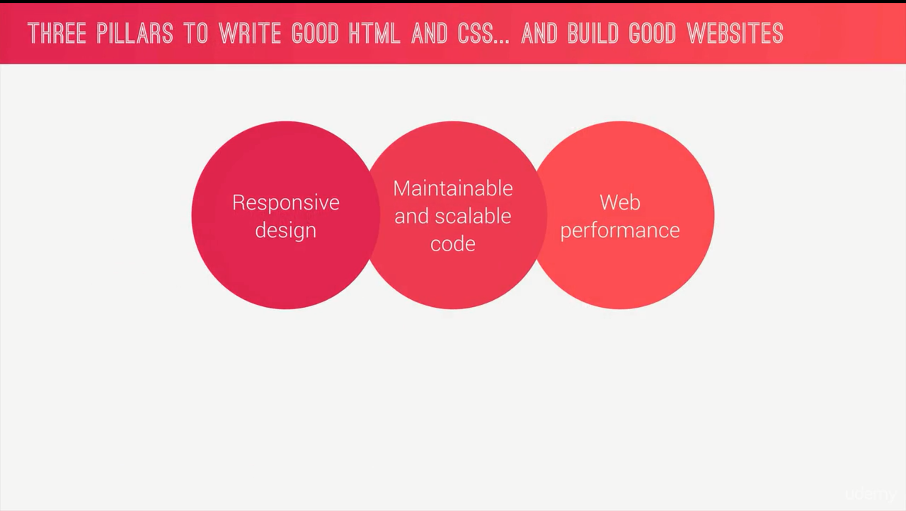
   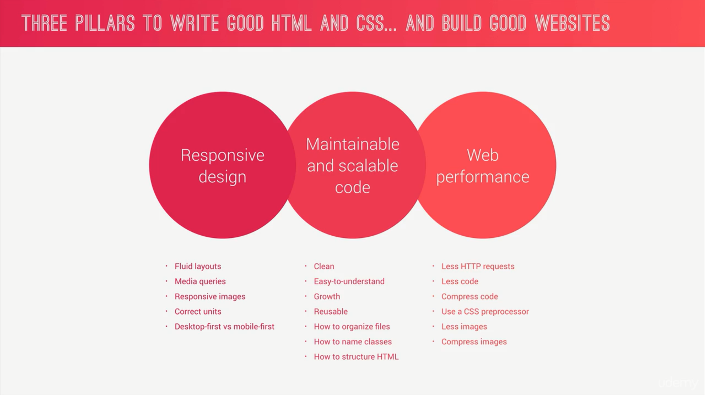

1. ## How CSS Works Behind the Scenes An Overview

   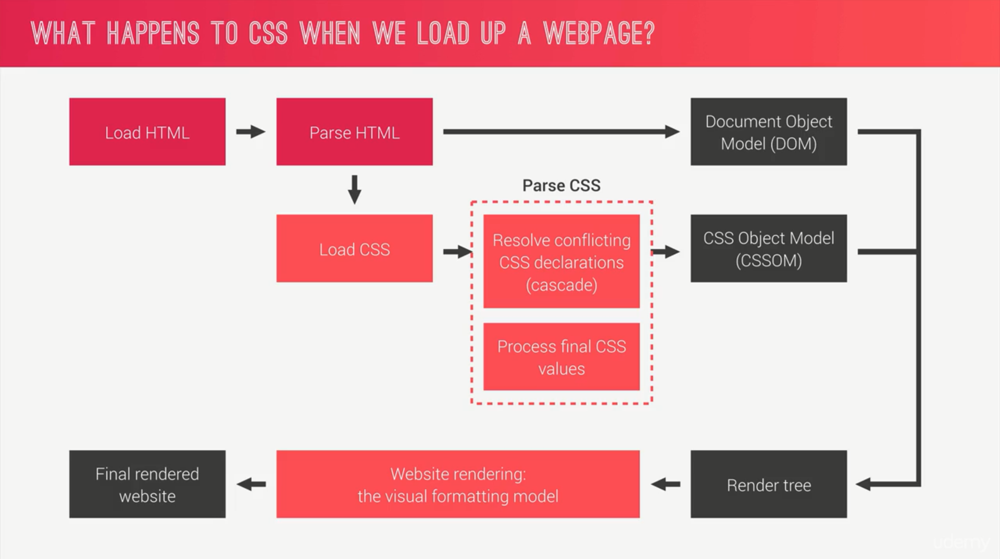
   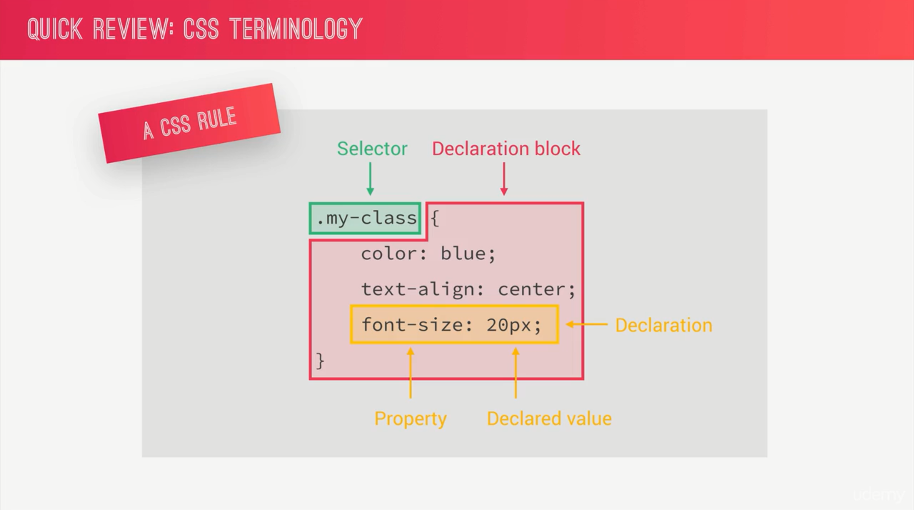
   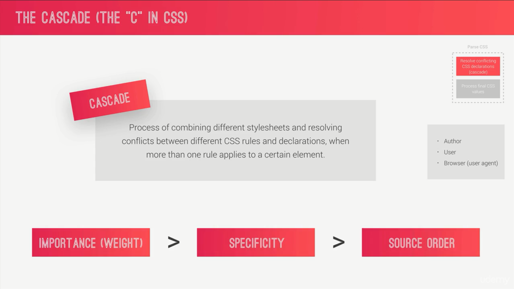
   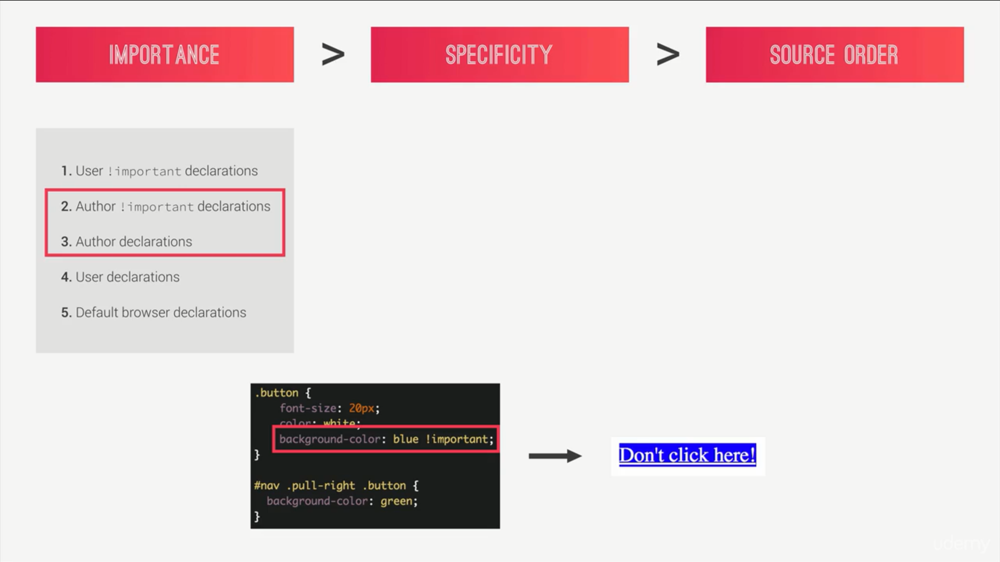
   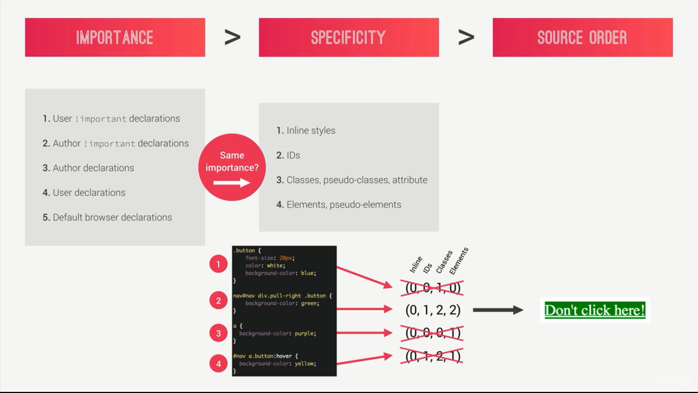
   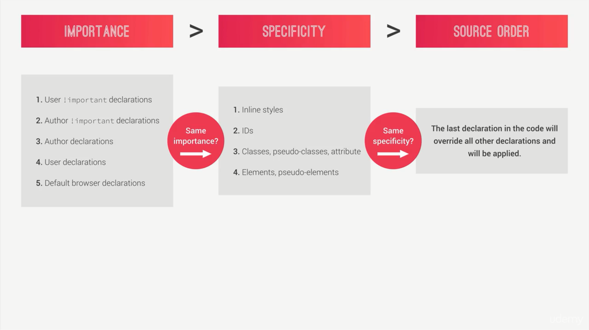
   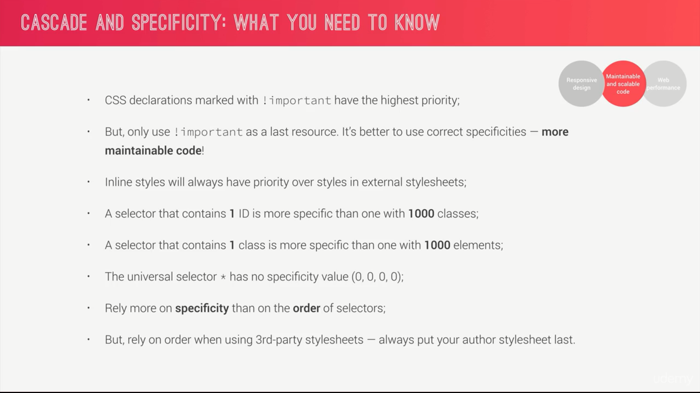

1. ## Specificity in Practice

   [Code Pen Example](https://codepen.io/wchamara/pen/wvKYxZg)

1. ## How CSS is Parsed, Part 2 Value Processing

   
   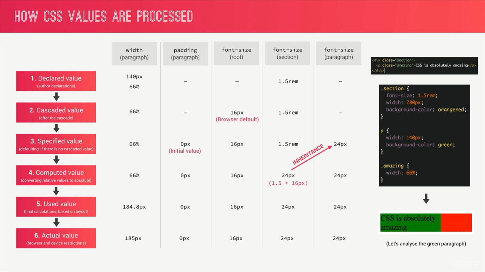
   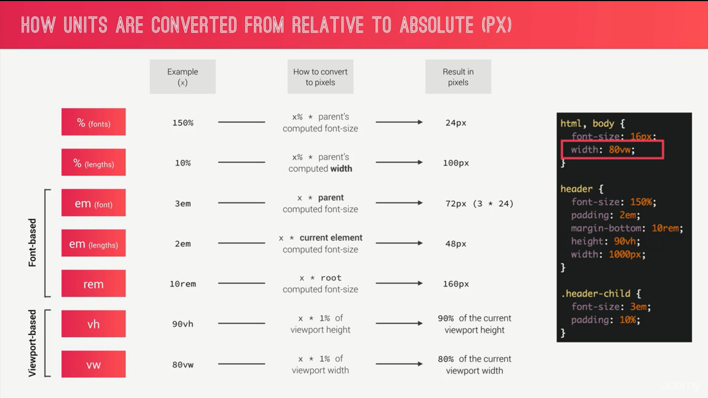
   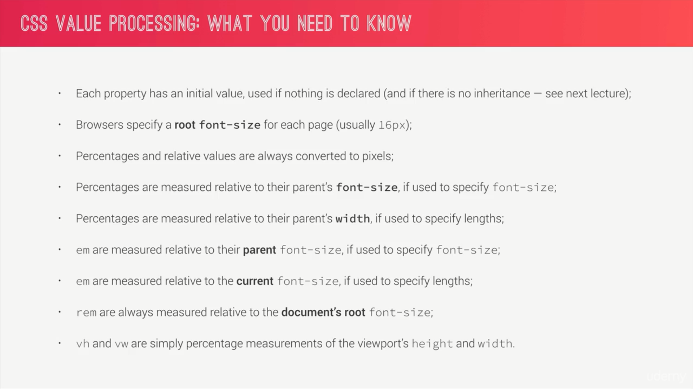

1. ## How CSS is Parsed, Part 3 Inheritance

   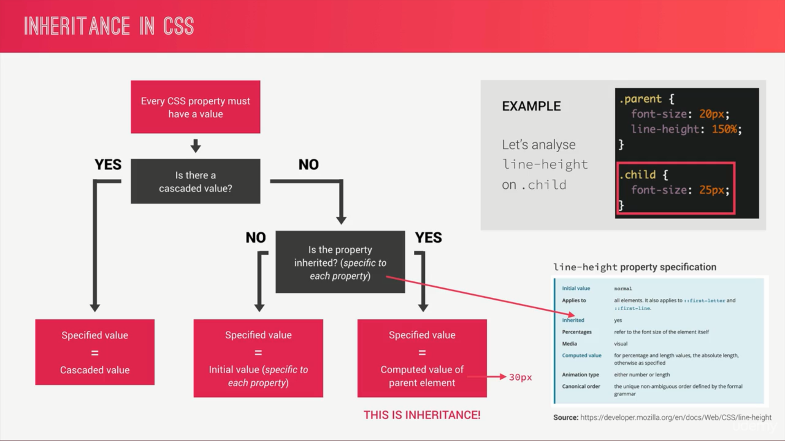
   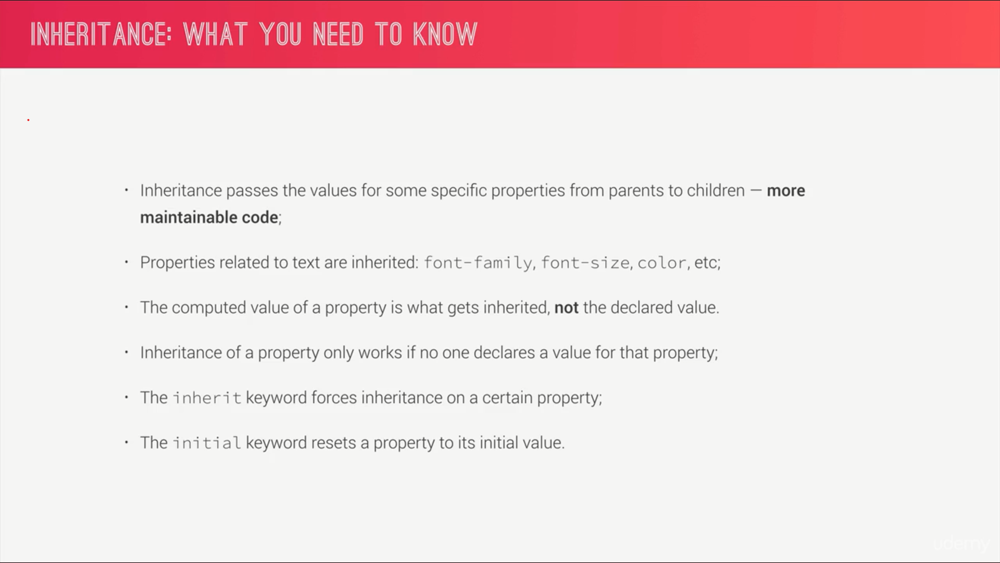

1. ## Converting px to rem An Effective Workflow

```css
/*
this is called a universal selector
*/
*,
::after,
::before {
  margin: 0;
  padding: 0;
  box-sizing: inherit;
}
html {
  font-size: 62.5%;
}

body {
  font-family: "Lato", sans-serif;
  font-weight: 400;
  font-size: 1.6rem;
  line-height: 1.7;
  color: #777;
  padding: 3rem;
  box-sizing: border-box;
}

.header {
  height: 95vh;
  background-image: linear-gradient(
      to right bottom,
      rgba(126, 213, 111, 0.8),
      rgba(40, 180, 133, 0.8)
    ), url("../img/travel.jpg");
  background-size: cover;
  background-position: top;
  background-repeat: no-repeat;
  clip-path: polygon(0 0, 100% 0, 100% 80vh, 0 101%);
  position: relative;
}

.logo-box {
  position: absolute;
  top: 4rem;
  left: 4rem;
}

.logo {
  height: 3.5rem;
}

.text-box {
  position: absolute;
  top: 40%;
  left: 50%;
  transform: translate(-50%, -50%);
  text-align: center;
}

.heading-primary {
  color: #fff;
  text-transform: uppercase;
  backface-visibility: hidden;
  margin-bottom: 6rem;
}

.heading-primary-main {
  display: block;
  font-size: 6rem;
  font-weight: 600;
  letter-spacing: 3.5rem;
  animation-name: moveInLeft;
  animation-duration: 1s;
  animation-timing-function: ease-out;
  /*
    animation-delay: 3s;
    animation-iteration-count: 4;

    */
}

.heading-primary-sub {
  display: block;
  font-size: 2rem;
  font-weight: 400;
  letter-spacing: 2.2rem;
  animation: moveInRight 1s ease-out;
}

/*for browser purformance it's best to animate only two properties*/
@keyframes moveInLeft {
  /*  start   */
  0% {
    opacity: 0;
    transform: translateX(-10rem);
  }
  /*  inBetween   */
  80% {
    transform: translateX(1rem);
  }
  /*  end     */
  100% {
    opacity: 1;
    transform: translateX(0);
  }
}

@keyframes moveInRight {
  /*  start   */
  0% {
    opacity: 0;
    transform: translateX(10rem);
  }
  /*  inBetween   */
  80% {
    transform: translateX(-1rem);
  }
  /*  end     */
  100% {
    opacity: 1;
    transform: translateX(0);
  }
}

@keyframes moveInBottom {
  /*  start   */
  0% {
    opacity: 0;
    transform: translateY(10rem);
  }

  /*  end     */
  100% {
    opacity: 1;
    transform: translateX(0);
  }
}

/*
link is a sudo class
*/
.btn:link,
.btn:visited {
  text-transform: uppercase;
  text-decoration: none;
  padding: 1.5rem 4rem;
  display: inline-block;
  border-radius: 4rem;
  transition: all 0.6s;
  position: relative;
}

.btn:hover {
  transform: translateY(-0.3rem);
  box-shadow: 0 10rem 20rem rgba(0, 0, 0, 0.2);
}

.btn:active {
  transform: translateY(-0.1rem);
  box-shadow: 0 0.5rem 1rem rgba(0, 0, 0, 0.2);
}

.btn:after {
  content: "";
  display: inline-block;
  width: 100%;
  height: 100%;
  border-radius: 10rem;
  position: absolute;
  top: 0;
  left: 0;
  z-index: -1;
  transition: all 0.4s;
}

.btn-white {
  background-color: white;
  color: #777;
}

.btn-white:after {
  background-color: white;
}

.btn:hover::after {
  transform: scaleX(1.4) scaleY(1.6);
  opacity: 0;
}

.btn-animated {
  animation: moveInBottom 0.5s ease-out 0.75s;
  animation-fill-mode: backwards;
}
```

1. ## How CSS Renders a Website The Visual Formatting Model

   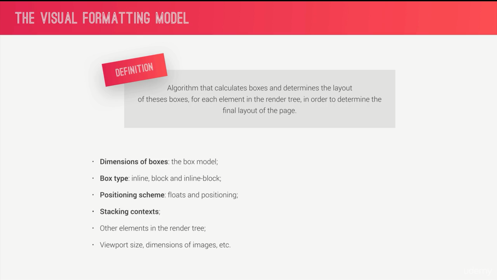
   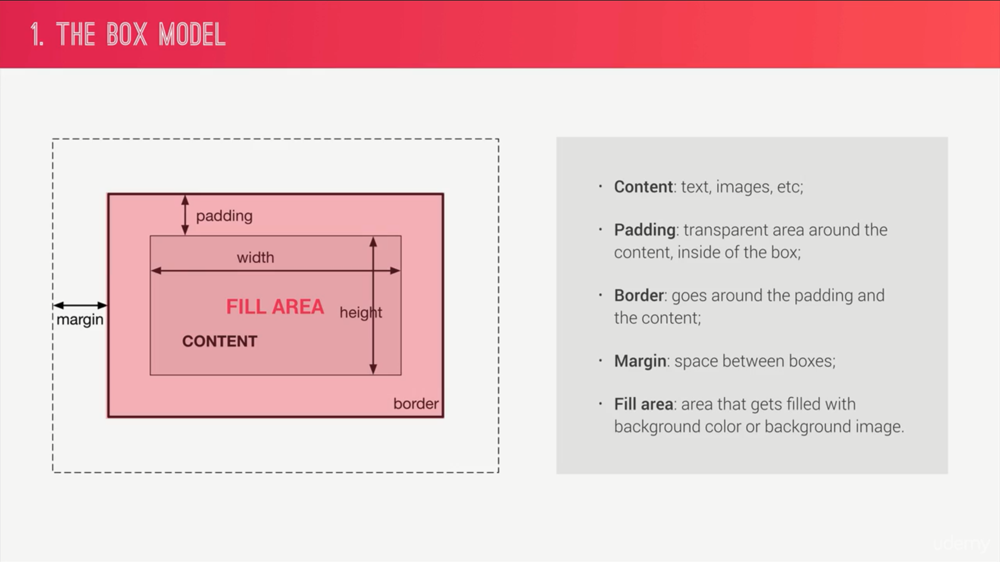
   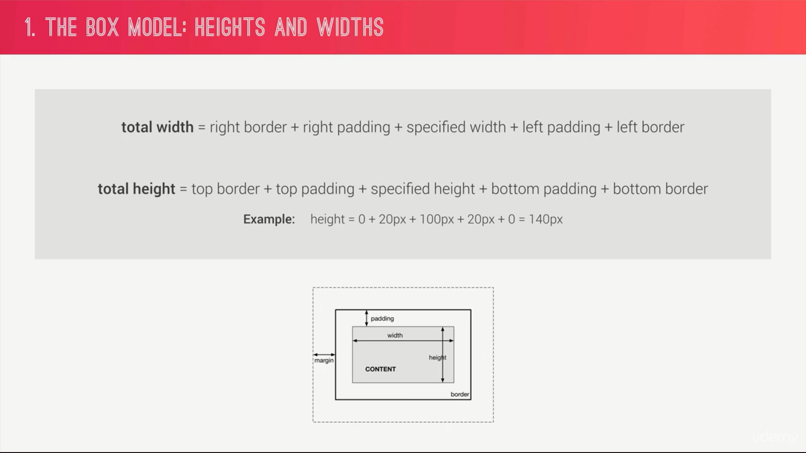
   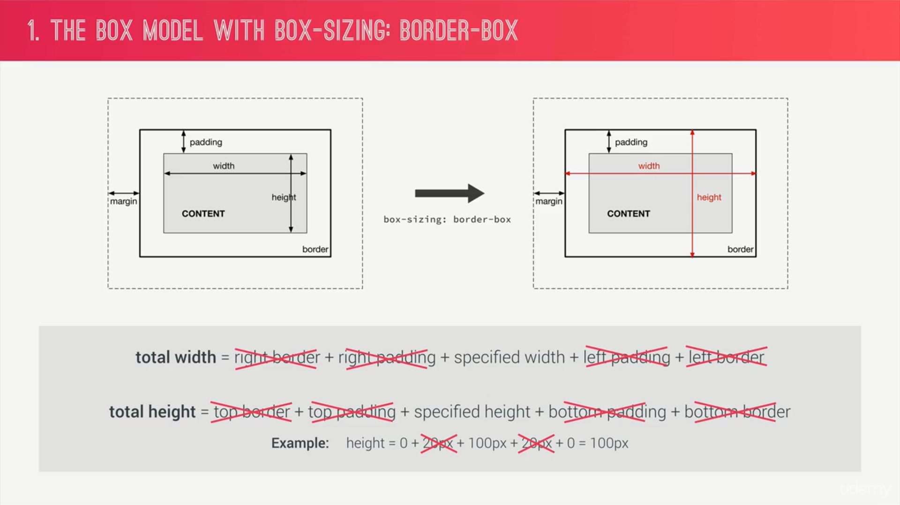
   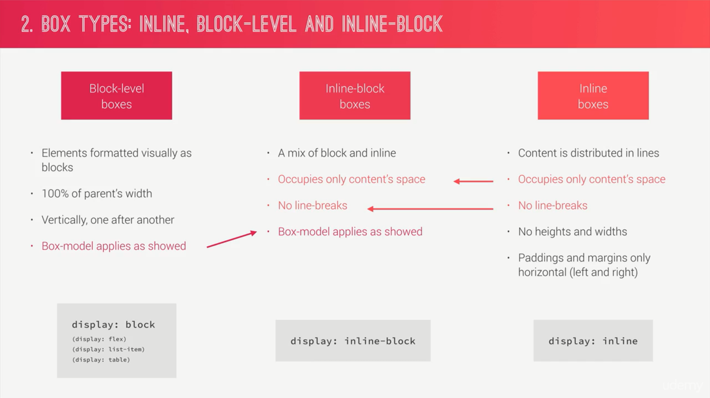
   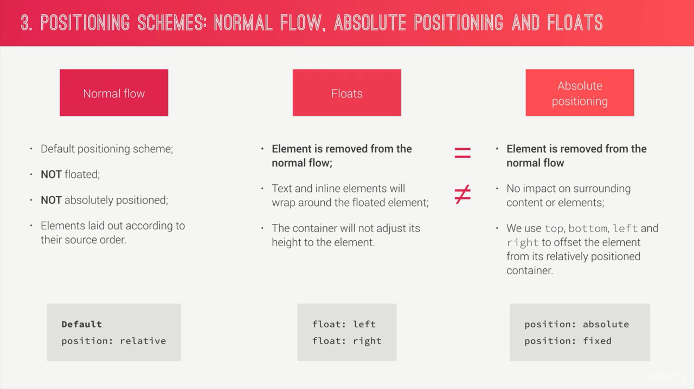
   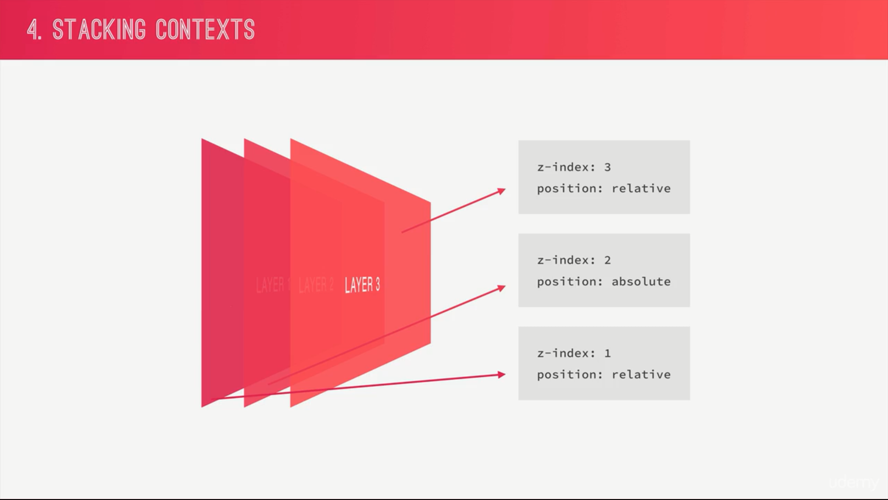

1. ## CSS Architecture, Components and BEM

   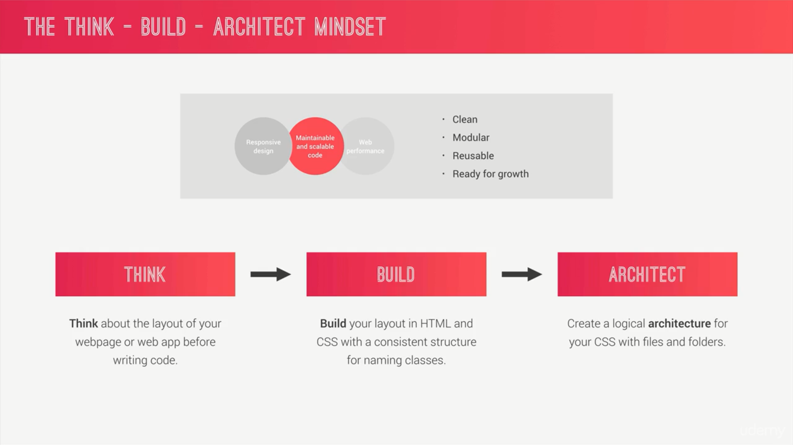
   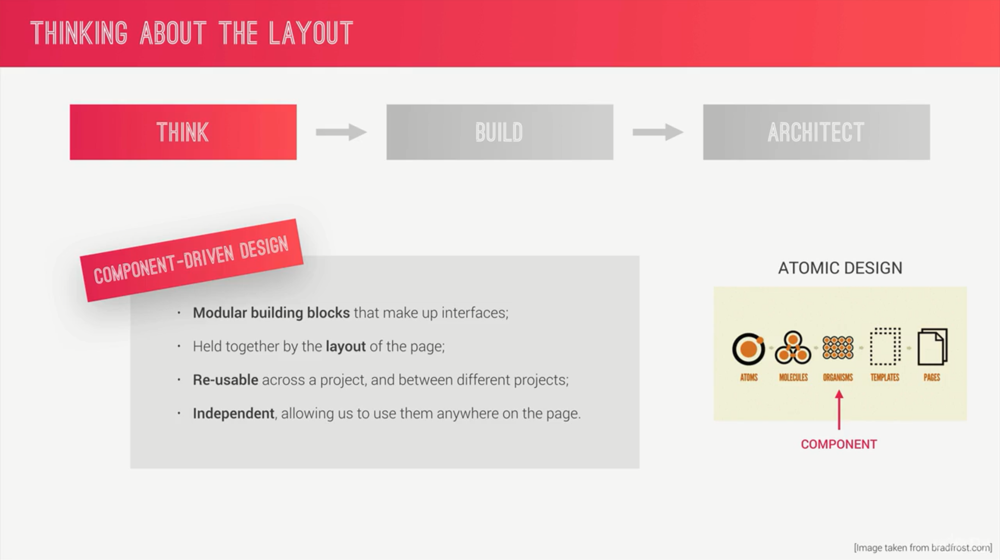
   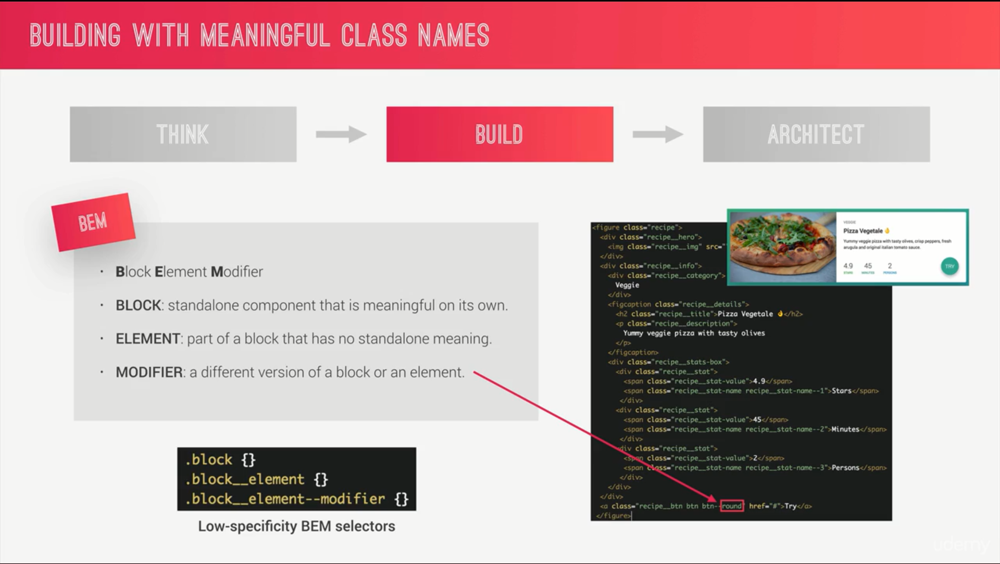
   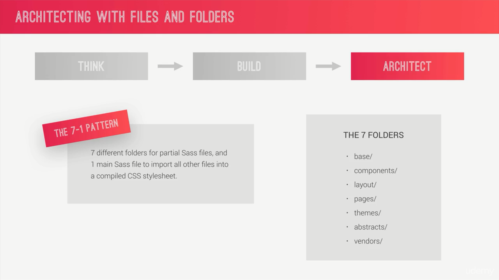

1. ## Implementing BEM in the Natours Project
