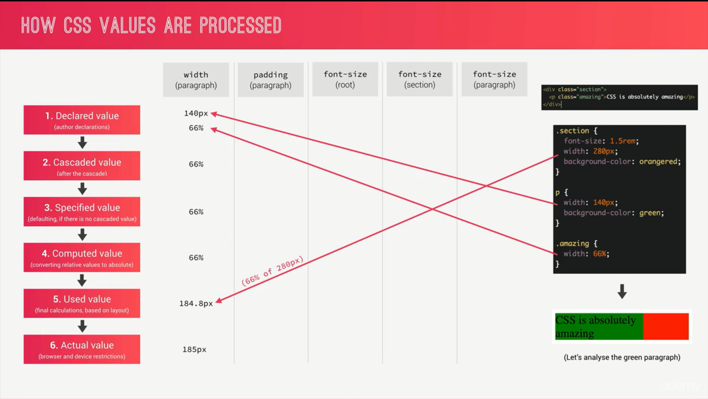

# How CSS Works A Look Behind the Scenes

1. ## Three Pillars of Writing Good HTML and CSS (Never Forget Them!)

   
   

1. ## How CSS Works Behind the Scenes An Overview

   
   
   
   
   
   
   

1. ## Specificity in Practice

   [Code Pen Example](https://codepen.io/wchamara/pen/wvKYxZg)

1. ## How CSS is Parsed, Part 2 Value Processing

   
   
   
   

1. ## How CSS is Parsed, Part 3 Inheritance

    
    

1. ## Converting px to rem An Effective Workflow

1. ## How CSS Renders a Website The Visual Formatting Model

1. ## CSS Architecture, Components and BEM

1. ## Implementing BEM in the Natours Project

   
